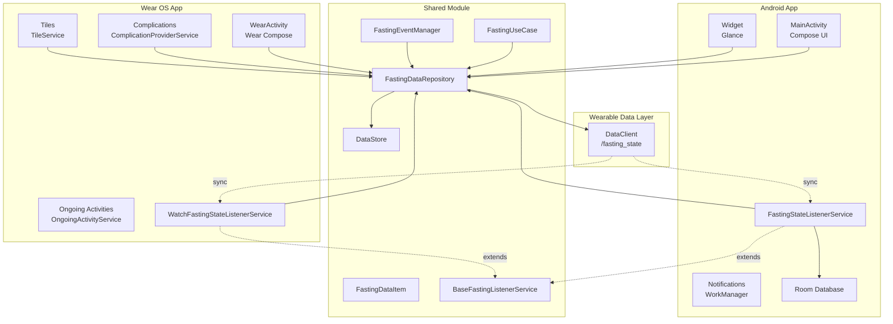
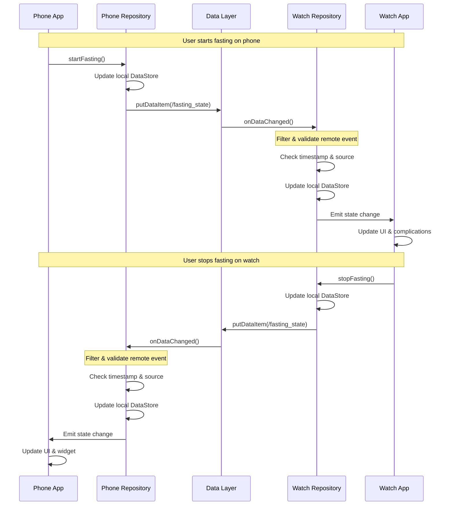
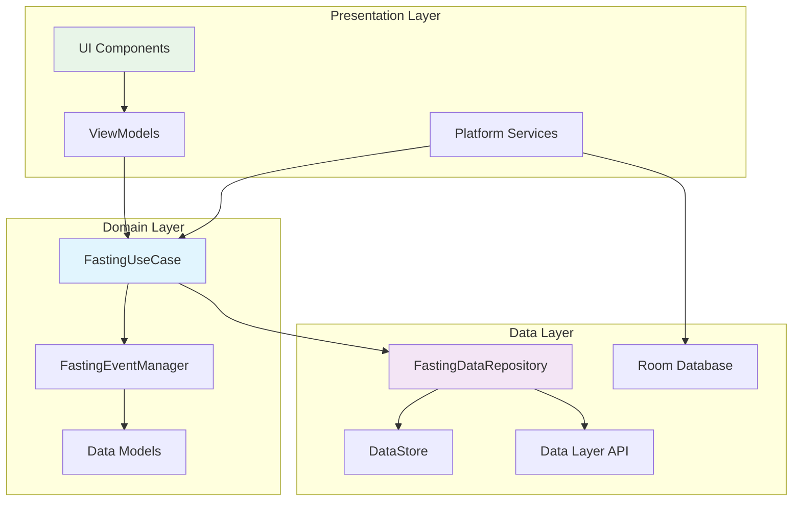

# Architecture

This document outlines the architecture of the fasting tracker application, focusing on the multi-platform design and data synchronization between Android phones/tablets and Wear OS devices.

## Overview

The application follows a clean architecture pattern with three main modules:

- **`shared`** - Android library module containing common business logic, data models, and synchronization
- **`app`** - Android application for phones/tablets with widgets and notifications  
- **`onewearos`** - Wear OS application with complications, tiles, and ongoing activities

## Core Data Models

### FastingDataItem
The primary data model representing the current fasting state:
```kotlin
data class FastingDataItem(
    val isFasting: Boolean,
    val startTimeInMillis: Long,
    val updateTimestamp: Long,
    val fastingGoalId: String
)
```

### FastGoal
Predefined fasting goals (13h, 16:8, 18:6, 20:4, 36h) with duration and display information.

### FastingRecord
Room entity for persisting completed fasting sessions in the local database.

## Repository Pattern

The architecture uses a reactive repository pattern with Kotlin Flows:

- **`FastingDataRepository`** interface defines the contract for data operations
- **`FastingDataRepositoryImpl`** handles local persistence via DataStore and remote synchronization
- **`FastingUseCase`** provides domain-level operations with business logic

## Service Architecture

### BaseFastingListenerService
Abstract `WearableListenerService` that both platforms extend:
- Filters local vs remote events to prevent synchronization loops
- Implements timestamp-based conflict resolution
- Coordinates with `FastingEventManager` for business logic callbacks

### Platform-Specific Services
- **App**: `FastingStateListenerService` handles widget updates and database operations
- **WearOS**: `WatchFastingStateListenerService` manages complications and ongoing activities

## Data Synchronization

Data synchronization uses the Wearable Data Layer API with sophisticated conflict resolution and event filtering.

### Implementation Details

#### Data Layer Configuration
- **Path**: `/fasting_state`
- **Keys**: `is_fasting`, `start_time`, `fasting_goal`, `update_timestamp`
- **API**: Uses `PutDataRequest` with DataMap for structured data transmission

#### Synchronization Flow
1. **Local State Change**: User actions trigger state updates in the repository
2. **Data Layer Update**: Repository publishes changes via `DataClient.putDataItem()`
3. **Remote Event Processing**: `WearableListenerService.onDataChanged()` receives events
4. **Event Filtering**: Services filter out local events using node ID comparison
5. **Conflict Resolution**: Timestamp-based resolution ensures latest state wins
6. **Local Update**: Remote events update local DataStore and trigger UI updates

#### Conflict Resolution Strategy
- Each update includes a `updateTimestamp` field
- When conflicts occur, the update with the latest timestamp takes precedence
- This prevents data loss during simultaneous updates from both devices

#### Event Loop Prevention
- Services compare the source node ID with the local node ID
- Local events are ignored to prevent infinite synchronization loops
- Only remote events trigger local state updates

## Platform-Specific Components

### Android App Module

#### Widget System
- **Implementation**: Jetpack Glance widgets for home screen integration
- **Updates**: Automatically refreshed when fasting state changes via `FastingStateListenerService`
- **Features**: Shows current fasting status, elapsed time, and goal progress

#### Notification System
- **WorkManager**: Schedules periodic notifications during fasting sessions
- **Channels**: Separate notification channels for different notification types
- **Actions**: Interactive notifications with quick action buttons

#### Data Persistence
- **Room Database**: Stores completed fasting records for history tracking
- **Repository**: `FastingRecordRepository` manages historical data operations

### Wear OS Module

#### Complications
- **Types**: Short text, long text, and circular progress complications
- **Data**: Real-time fasting status and progress for watch faces
- **Updates**: Automatically refreshed via `ComplicationProviderService`

#### Tiles
- **Quick Access**: Interactive tile for starting/stopping fasting sessions
- **Layout**: Optimized for small screen with essential information only
- **Actions**: Direct fasting control without opening the main app

#### Ongoing Activities
- **Service**: `OngoingActivityService` provides persistent notifications during fasting
- **Display**: Shows elapsed time and goal progress on watch face
- **Lifecycle**: Automatically starts/stops with fasting sessions

#### Health Services Integration
- **Data Sources**: Integrates with Wear OS health data for enhanced tracking
- **Permissions**: Requests appropriate health and activity permissions

## Architectural Patterns

### Clean Architecture
The application follows clean architecture principles:

- **Data Layer**: Repository implementations, data sources (DataStore, Room, Data Layer API)
- **Domain Layer**: Use cases, business logic, and core models
- **Presentation Layer**: UI components, ViewModels, and platform-specific features

### Reactive Programming
- **Kotlin Flows**: Used throughout for reactive state management
- **StateFlow**: Exposes UI state in a lifecycle-aware manner
- **SharedFlow**: Handles one-time events and side effects

### Dependency Injection
- **Koin**: Lightweight DI framework used across all modules
- **Module Organization**: Separate DI modules for data, domain, and presentation layers
- **Platform Injection**: Platform-specific services injected at runtime

### Error Handling
- **Result Pattern**: Wraps operations that can fail with success/error states
- **Flow Error Handling**: Uses `catch` operators for graceful error recovery
- **Logging**: Structured logging for debugging synchronization issues

### Architecture Diagrams

#### High-Level System Architecture



#### Data Synchronization Flow



#### Component Dependencies


