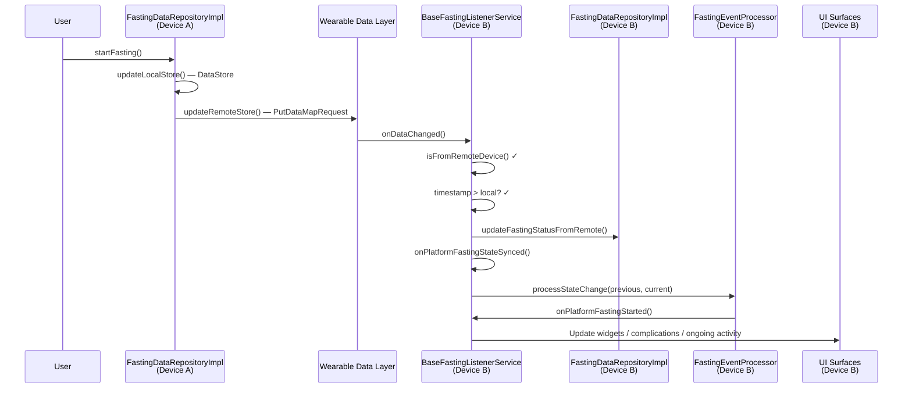

# Data Sync — Phone & Wear OS

## Overview

ONE uses the **Wearable Data Layer API** (Google Play Services) for bidirectional sync between the phone and Wear OS apps. When a user starts or stops a fast on either device, the change propagates to the other device within seconds.

The sync layer lives in `:core:data` and is exposed through domain contracts in
`:core:domain`. Both `:app` and `:wear` extend shared data-layer base classes
with platform-specific hooks.

## Package Name Requirement

Both `:app` and `:wear` **must** share the same `applicationId`:

```
com.charliesbot.one
```

This is a Google Play Services requirement. The Wearable Data Layer only connects apps that share the same package name across phone and watch. If the IDs diverge, sync silently stops working.

> The Wear OS `versionCode` is offset by +1 to avoid Play Store upload conflicts.

## Data Paths and Keys

### `/fasting_state` — Bidirectional (phone <-> watch)

| Key                | Type     | Description                          |
| ------------------ | -------- | ------------------------------------ |
| `is_fasting`       | Boolean  | Whether a fast is currently active   |
| `start_time`       | Long     | Fast start time in epoch millis      |
| `fasting_goal`     | String   | Goal ID (e.g. `"16:8"`, `"18:6"`)   |
| `update_timestamp` | Long     | Epoch millis — used for conflict res |

### `/smart_reminder` — One-way (phone -> watch)

| Key              | Type   | Description                            |
| ---------------- | ------ | -------------------------------------- |
| `suggested_time` | Long   | Suggested fasting start time in millis |
| `reasoning`      | String | Human-readable explanation             |
| `timestamp`      | Long   | When the reminder was generated        |

### `/settings` — One-way (phone -> watch)

| Key                        | Type    | Description                        |
| -------------------------- | ------- | ---------------------------------- |
| `notifications_enabled`    | Boolean | Global notification toggle         |
| `notify_completion`        | Boolean | Notify when fast completes         |
| `notify_one_hour_before`   | Boolean | Notify 1 hour before completion    |
| `smart_reminders_enabled`  | Boolean | Smart reminder feature toggle      |
| `bedtime_minutes`          | Int     | Bedtime as minutes from midnight   |
| `fixed_fasting_start_minutes` | Int  | Fixed start time as minutes from midnight |
| `smart_reminder_mode`      | String  | `AUTO`, `BEDTIME_ONLY`, `MOVING_AVERAGE_ONLY`, or `FIXED_TIME` |
| `timestamp`                | Long    | When settings were last updated    |

### `/custom_goals` — One-way (phone -> watch)

| Key                      | Type   | Description                           |
| ------------------------ | ------ | ------------------------------------- |
| `custom_goals_json`      | String | Serialized list of custom goal data   |
| `custom_goals_timestamp` | Long   | When custom goals were last updated   |

## Sync Flow

### User starts a fast (on either device)



### User stops a fast (on either device)

Same flow, but `FastingEventProcessor.processStateChange()` detects the
`wasFasting && !isNowFasting` transition and calls
`onPlatformFastingCompleted()` instead.

## Conflict Resolution

**Timestamp-based: newest wins.** Every sync payload includes `update_timestamp` (epoch millis). `BaseFastingListenerService` compares the incoming timestamp against the local one and discards stale updates:

```
if (newestRemoteItem.updateTimestamp > currentLastTimestamp) → apply
else → discard
```

`getLatestFastingState()` also handles multiple events in a single `DataEventBuffer` by selecting the one with the highest timestamp.

## Local Event Filtering

The Wearable Data Layer fires `onDataChanged` on **all** connected nodes, including the device that wrote the data. Without filtering, this creates an infinite sync loop.

`BaseFastingListenerService.isFromRemoteDevice()` prevents this:

```
event.dataItem.uri.host  →  source node ID
nodeClient.localNode.id  →  local node ID

if (sourceNodeId != localNodeId) → process
else → skip
```

If the local node ID can't be determined (e.g. Play Services unavailable), events are processed anyway to avoid data loss.

## One-Way vs Bidirectional

| Path              | Direction          | Reason                                                    |
| ----------------- | ------------------ | --------------------------------------------------------- |
| `/fasting_state`  | Phone <-> Watch    | Users can start/stop fasts on either device               |
| `/settings`       | Phone -> Watch     | Settings UI only exists on phone; watch applies silently  |
| `/smart_reminder` | Phone -> Watch     | Reminders are computed on phone; watch schedules locally   |
| `/custom_goals`   | Phone -> Watch     | Custom-goal editing exists on phone; watch reflects goals  |

For one-way paths, the watch listener applies updates with `syncToRemote = false` to prevent echoing data back to the phone.

## UI Surfaces Updated After Sync

When a remote sync event arrives, platform-specific hooks update all relevant UI surfaces:

### Phone (`FastingStateListenerService`)

| Surface          | Update mechanism                        |
| ---------------- | --------------------------------------- |
| Glance widgets   | `WidgetUpdateManager.requestUpdate()`   |

### Watch (`WatchFastingStateListenerService`)

| Surface              | Update mechanism                                |
| -------------------- | ----------------------------------------------- |
| Complications        | `ComplicationUpdateManager.requestUpdate()`     |
| Ongoing activities   | `OngoingActivityService` start/stop             |

Both `WidgetUpdateManager` and `ComplicationUpdateManager` debounce requests (1s window) to avoid redundant updates from rapid state changes.

## Key Files

| Component                      | File                                                                                   |
| ------------------------------ | -------------------------------------------------------------------------------------- |
| Data Layer constants           | `core/src/main/java/.../core/constants/DataLayerConstants.kt`                          |
| DataStore constants            | `core/src/main/java/.../core/constants/DataStoreConstants.kt`                          |
| Fasting data repository        | `core/data/src/main/java/.../core/data/repository/FastingDataRepositoryImpl.kt`        |
| Settings repository            | `core/data/src/main/java/.../core/data/repository/SettingsRepositoryImpl.kt`           |
| Custom goal repository         | `core/data/src/main/java/.../core/data/repository/CustomGoalRepositoryImpl.kt`         |
| Base listener service          | `core/data/src/main/java/.../core/data/services/BaseFastingListenerService.kt`         |
| Fasting event processor        | `core/domain/src/main/java/.../core/domain/events/FastingEventProcessor.kt`            |
| FastingDataItem model          | `core/model/src/main/java/.../core/models/FastingDataItem.kt`                          |
| Latest state utility           | `core/data/src/main/java/.../core/data/sync/GetLatestDataUpdate.kt`                    |
| DataMap converter              | `core/data/src/main/java/.../core/data/sync/GetFastingItemFromDataLayer.kt`            |
| Phone listener service         | `app/.../one/services/FastingStateListenerService.kt`                                  |
| Widget update manager          | `widget/src/main/java/.../one/widget/WidgetUpdateManager.kt`                           |
| Watch listener service         | `wear/.../onewearos/presentation/services/WatchFastingStateListenerService.kt`         |
| Complication update manager    | `complications/src/main/java/.../onewearos/complications/ComplicationUpdateManager.kt` |
| Ongoing activity service       | `wear/.../onewearos/presentation/services/OngoingActivityService.kt`                   |

> Paths abbreviated with `...` for readability. Full base: `src/main/java/com/charliesbot/`.
